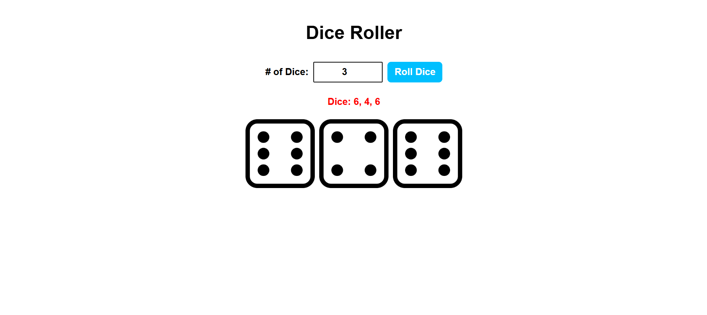

# 🎲 Dice Roller

A simple web app that simulates rolling dice. Built with HTML, CSS, and JavaScript.

## 🚀 Features

- Input how many dice you want to roll
- Random dice face images display instantly
- Visual and numerical result shown

## 📸 Demo

## 🛠️ Technologies Used

- HTML
- CSS
- JavaScript
